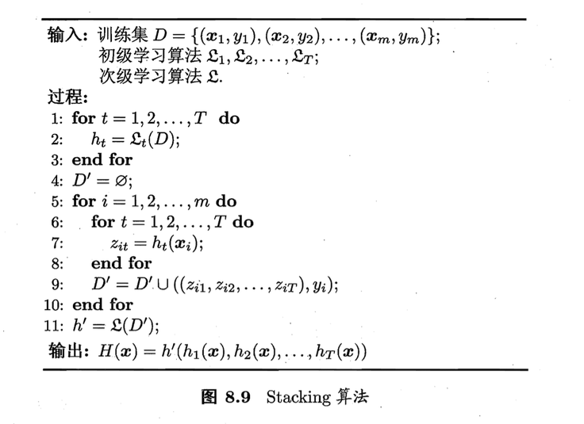
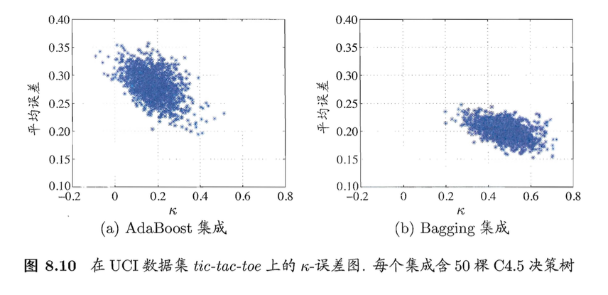

# 集成学习

### 8.1 个体与集成

- 通过构建并结合多个学习器来完成学习任务，有时也称为多分类系统、基于委员会的学习等

- 要获得好的集成，个体学习器应“好而不同”，即个体学习器要有一定的“准确性”，即学习器不能太坏，并且要有“多样性”，即学习器间要有差异。
- 根据个体学习器的生成方式，目前的集成学习方法大致分为两类：
  - 个体学习器间`存在强依赖关系`、必须串行生成的`序列化`方法。代表：`Boosting`
  - 个体学习器间`不存在强依赖关系`、可同时生成的`并行化`方法。代表：`Bagging`、`Random Forest`

### 8.2 Boosting

- 是一族可将弱分类学习器提升为强化学习器的算法。
- 先3从初始训练集训练出一个基学习器，再根据基学习器的表现对训练样本分布进行调整，使得先前基学习器做错的训练样本在后续受到更多关注，然后预计调整后的样本分布来训练下一个基学习器；如此重复进行，直至基学习器数目达到事先指定的值T，最终将在这T个基学习器进行加权结合。

### 8.3 Bagging与随机森林

- Bagging是并行式集成学习方法最著名的代表，基于`自助采样法`

##### 8.3.1 Bagging

- m个样本的采样集，则基学习器的计算复杂度为O（m），则bagging的复杂度 大致为T（O（m）+O（s）），考虑到采样与投票/平均过程的复杂度O（s）很小，所以bagging是一个很高效的集成学习算法。
- bagging能不经修改地进行用于多分类、回归等任务。
- `外包估计`

##### 8.3.2 随机森林

- 简称RF，是Bagging的一个变体。
- RF在以决策树为基学习器构建Bagging集成的基础上，进一步在决策树的训练过程中引入了随机选择。具体来说，传统决策树在选择划分属性时在当前节点的属性集合（假定有d个属性）中选择一个最优属性；而在RF中，对基决策树的每个节点，先从该节点的属性集合中随机选择一个包含k个属性的子集，然后再从这个子集中选择一个最优属性用于划分。

- 随机森林简单、容易实现、计算开销小

- 随机森林随着个体学习器的增加，通常会收敛到更低的泛化误差。

### 结合策略

- 可能的好处：
  - 从统计方面来看，由于学习任务的假设空间往往很大，可能有多个假设在训练集上达到同等的性能，此时若使用单学习器可能因误选而导致泛化性能不佳，结合多个学习器则会减少这一风险
  - 从计算的方面来看，学习算法往往会陷入局部极小，有的局部极小点所对应的泛化性能可能很糟糕，而通过多次运行之后进行结合，可降低陷入糟糕局部极小点的风险
  - 从表示的方面来看，某些学习任务的真实假设可能不在当前学习算法所考虑的假设空间中，此时若使用单学习器则肯定无效，而通过结合多个学习器，由于相应的假设空间有所扩大，有可能学得更好的近似

##### 8.4.1 平均法

- 对数值型输出$h_i(x) \epsilon R$
- `简单平均法`：$H(x) = \frac{1}{T} \sum_{i=1}^T h_i(x)$
- `加权平均法`：$H(x) = \sum_{i=1}^T w_ih_i(x)$，其中$w_i$是个体学习器$h_i$的权重，通常要求$w_i \geqslant 0, \sum_{i = 1}^Tw_i = 1$
- 一般而言，在个体学习器性能相差较大时宜使用加权平均法，而在个体学习器性能相近时宜使用简单平均法

##### 8.4.2 投票法

- `绝对多数投票法`：若某标记得票过半数，则预测为该标记；否则拒绝预测
- `相对多数投票法`：预测为得票最多的标记，若同时有多个标记获得最高票，则从中随机选取一个
- `加权投票法`
- 不同的个体学习器可能产生不同类型的$h_i^j(x)$，常见的有：
  - `类标记`：$h_i^j(x) \epsilon \{0, 1\}$，若$h_i$将样本$x$预测为类别$c_j$则取值为1，否则为0，也称“硬投票”
  - `类概率`：$h_i^j(x) \epsilon [0, 1]$，相当于对后验概率$P(c_j | x)$的一个估计，也称“软投票”

##### 8.4.3 学习法

- 用于结合的学习器称为`次级学习器`或`元学习器`

### 8.5 多样性

##### 8.5.1 误差-分歧分解

- 个体学习器准确性越高、多样性越大，则集成越好

##### 8.5.2 多样性度量

- 不合度量
- 相关系数
- Q-统计量
- k-统计量

##### 8.5.3 多样性增强

- `数据样本扰动`：给定初始数据集，可从中产生出不同的数据子集，再利用不同的数据子集训练出不同的个体学习器
- `输入输出扰动`

- `输出表示扰动`：基本思路是对输出表示进行操纵以增强多样性
- `算法参数扰动`：
