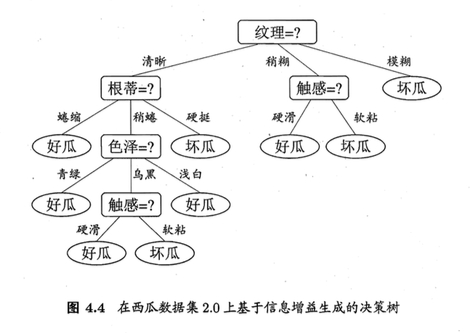
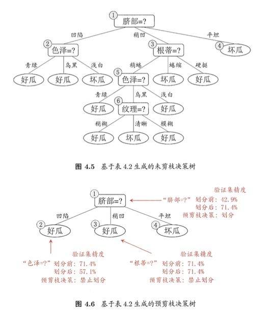

# 决策树

### 4.1 基本流程

### 4.2 划分选择

##### 4.2.1 信息增益

- `信息增益`是度量样本集合纯度最常用的一种指标。假定当前样本集合D中第k类样本所占比例为$p_k(k = 1, 2, ..., |y|)$，则D的信息增益为$$Ent(D) = - \sum_{k = 1}^{|y|} p_k \log_2p_k$
Ent(D)的值越小，则D的纯度越高

##### 4.2.2 增益率

- 增益率定义为$$Gain\_ratio(D, a) = \frac{Gain(D, a)}{IV(a)}$$

##### 4.3.2 基尼系数

- “CART”决策树使用基尼系数来选择划分属性
- 数据集D的纯度可用基尼值来度量：$$Gini(D) = \sum_{k = 1}^{|y|} \sum_{{k}' \neq k} p_k p_{{k}'} = 1 - \sum_{k = 1}^{|y|} p_k^2·$$
- Gini(D)越小，则数据集D的纯度越高

### 4.3 剪枝处理

- 剪枝是决策树学习算法对付“过拟合”的主要手段
- 基本策略有
  - “预剪枝”
  - “后剪枝”

##### 4.3.1 预剪枝

##### 4.3.2 后剪枝

### 4.4 连续与缺失值

##### 4.4.1 连续值处理

##### 4.4.2 缺失值处理

### 4.5 多变量决策树
