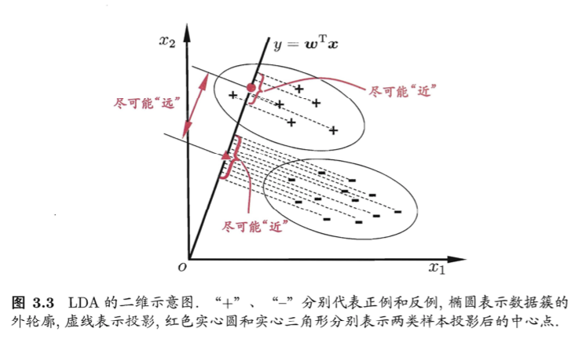

记录传统机器学习的工作流程中的基本数学原理和实例代码。算是《机器学习》--周志华的总结

## 目录

* [1--特征工程](#1--特征工程)
  * [1.1--数据预处理](#1.1--数据预处理)
  * [1.2--特征选择](#1.2--特征选择)
    * [1.2.1--过滤式选择(Filter)](#1.2.1--过滤式选择(Filter))
    * [1.2.2--包裹式选择(Wrapper)](#1.2.2--包裹式选择(Wrapper))
    * [1.2.3--嵌入式选择(Embedded)](#1.2.3--嵌入式选择(Embedded))
* [2--数据降维](#2--数据降维)
  * [2.1--主成分分析PCA](#2.1--主成分分析PCA)
  * [2.2--线性判别分析LDA](#2.2--线性判别分析LDA)
  * [2.3--奇异值分解SVD](#2.3--奇异值分解SVD)
* [3--模型选择](#3--模型选择)
* [4--模型评估](#4--模型评估)
* [5--具体学习模型对比](#5--具体学习模型对比)
* [6--集成学习](#6--集成学习)
  * [6.1--混合（Blending）](#6.1--混合（Blending）)
  * [6.2--装袋（Bagging）](#6.2--装袋（Bagging）)
  * [6.3--提升（Boosting）](#6.3--提升（Boosting）)
  * [6.4--堆叠（Stacking）](#6.4--堆叠（Stacking）)
  * [6.5--对比](#6.5--对比)
* [综合参考链接](#综合参考链接)

# 1--特征工程

## 1.1--数据预处理

- 不属于同一量纲：即特征的规格不一样，不能够放在一起比较。无量纲化可以解决这一问题。
- 信息冗余：对于某些定量特征，其包含的有效信息为区间划分，例如学习成绩，假若只关心“及格”或不“及格”，那么需要将定量的考分，转换成“1”和“0”表示及格和未及格。二值化可以解决这一问题。
- 定性特征不能直接使用：某些机器学习算法和模型只能接受定量特征的输入，那么需要将定性特征转换为定量特征。最简单的方式是为每一种定性值指定一个定量值，但是这种方式过于灵活，增加了调参的工作。通常使用哑编码的方式将定性特征转换为定量特征：假设有N种定性值，则将这一个特征扩展为N种特征，当原始特征值为第i种定性值时，第i个扩展特征赋值为1，其他扩展特征赋值为0。哑编码的方式相比直接指定的方式，不用增加调参的工作，对于线性模型来说，使用哑编码后的特征可达到非线性的效果。
- 存在缺失值：缺失值需要补充。
- 信息利用率低：不同的机器学习算法和模型对数据中信息的利用是不同的，之前提到在线性模型中，使用对定性特征哑编码可以达到非线性的效果。类似地，对定量变量多项式化，或者进行其他的转换，都能达到非线性的效果。

### 1.1.1--无量纲化

- 无量纲化使不同规格的数据转换到同一规格。常见的无量纲化方法有标准化和区间缩放法。标准化的前提是特征值服从正态分布，标准化后，其转换成标准正态分布。区间缩放法利用了边界值信息，将特征的取值区间缩放到某个特点的范围，例如[0, 1]等。

#### 1.1.1.1--标准化

- 标准化需要计算特征的均值和标准差，公式表达为：
<div align="center"></div>

- Example-Code:

```python
```

#### 1.1.1.2--区间缩放法

- 区间缩放法的思路有多种，常见的一种为利用两个最值进行缩放，公式表达为：
<div align="center"></div>

- Example-Code:

```python
```

#### 1.1.1.3--标准化与归一化的区别

- 简单来说，标准化是依照特征矩阵的列处理数据，其通过求z-score的方法，将样本的特征值转换到同一量纲下。归一化是依照特征矩阵的行处理数据，其目的在于样本向量在点乘运算或其他核函数计算相似性时，拥有统一的标准，也就是说都转化为“单位向量”。规则为l2的归一化公式如下：
<div align="center"></div>

- Example-Code:

```python
```

### 1.1.2--对定量特征二值化

- 定量特征二值化的核心在于设定一个阈值，大于阈值的赋值为1，小于等于阈值的赋值为0，公式表达如下：
<div align="center"> threshold \\ 
0, & x \leqslant  threshold
\end{matrix}\right."></div>

- Example-Code:

```python
```

### 1.1.3--对定性特征哑编码

- 由于IRIS数据集的特征皆为定量特征，故使用其目标值进行哑编码（实际上是不需要的）。使用preproccessing库的OneHotEncoder类对数据进行哑编码的代码如下：
<div align="center"></div>

- Example-Code:

```python
```

### 1.1.4--缺失值计算

- 由于IRIS数据集没有缺失值，故对数据集新增一个样本，4个特征均赋值为NaN，表示数据缺失。使用preproccessing库的Imputer类对数据进行缺失值计算的代码如下：
<div align="center"></div>

- Example-Code:

```python
```

### 1.1.5--数据变换

- 常见的数据变换有基于多项式的、基于指数函数的、基于对数函数的。4个特征，度为2的多项式转换公式如下：
<div align="center"></div>

- Example-Code:

```python
```

- 基于单变元函数的数据变换可以使用一个统一的方式完成，使用preproccessing库的FunctionTransformer对数据进行对数函数转换的代码如下：

- Example-Code:

```python
```
## 1.2--特征选择

###### 概述

- 特征选择（英语：feature selection）也被称为变量选择、属性选择 或变量子集选择 。它是指：为了构建模型而选择相关特征（即属性、指标）子集的过程。使用特征选择技术有三个原因：
  - 简化模型，使之更易于被研究人员或用户理解
  - 缩短训练时间
  - 改善通用性、降低过拟合（即降低方差）

###### 链接

- [特征选择 | Wiki](https://zh.wikipedia.org/wiki/%E7%89%B9%E5%BE%81%E9%80%89%E6%8B%A9)
- [特征选择 | 知乎](https://zhuanlan.zhihu.com/p/32749489)

### 1.2.1--过滤式选择(Filter)

###### 原理

- 按照发散性或者相关性对各个特征进行评分，设定阈值或者待选择阈值的个数，选择特征。


#### 1.2.1.1--方差选择法

###### 原理


#### 1.2.1.2--相关系数法

###### 原理


#### 1.2.1.3--卡方检验

- 经典的卡方检验是检验定性自变量对定性因变量的相关性。假设自变量有N种取值，因变量有M种取值，考虑自变量等于i且因变量等于j的样本频数的观察值与期望的差距，构建统计量：
<div align="center"></div>

- Example-Code:

```python
```

#### 1.2.1.4--互信息和最大信息系数

- 经典的互信息也是评价定性自变量对定性因变量的相关性的，互信息计算公式如下：
<div align="center"></div>

- Example-Code:

```python
```

#### 1.2.1.5--Pearson相关系数

<div align="center"></div>

- Example-Code:

```python
```

#### 1.2.1.6--距离相关系数

<div align="center"></div>

- Example-Code:

```python
```

### 1.2.2--包裹式选择(Wrapper)


###### 原理

- 根据目标函数（通常是预测效果评分），每次选择若干特征，或者排除若干特征。

#### 1.2.2.1--递归特征消除法

<div align="center"></div>

- Example-Code:

```python
```


#### 1.2.2.2--前向搜索

<div align="center"></div>

- Example-Code:

```python
```


#### 1.2.2.3--后向搜索

<div align="center"></div>

- Example-Code:

```python
```


### 1.2.3--嵌入式选择(Embedded)

###### 原理

- 先使用某些机器学习的算法和模型进行训练，得到各个特征的权值系数，根据系数从大到小排序选择特征。类似于Filter方法，但是是通过训练来确定特征的优劣。

#### 1.2.3.1--基于惩罚项的特征选择法

<div align="center"></div>

- Example-Code:

```python
```


#### 1.2.3.2--基于树模型的特征选择法

<div align="center"></div>

- Example-Code:

```python
```


#### 1.2.3.3--基于学习模型的特征排序

<div align="center"></div>

- Example-Code:

```python
```


# 2--数据降维

### 2.1--主成分分析PCA

###### 原理

- 首先考虑一个问题：对于正交属性空间中的样本点，如何用一个超平面（直线的高维推广）对所有样本进行恰当的表达？可以想到，若存在这样的超平面，那么它大概具有这样的性质：
  - 最近重构性：样本点到这个超平面的距离足够近
  - 最大可分性：样本点在这个超平面上的投影能尽可能的分开
- 基于最近重构性和最大可分性能分别得到主成分分析的两种等价推到，我们这里主要考虑最大可分性，并且一步一步推到出最终PCA。

###### 


###### 示例代码

###### 优缺点

- 优点：
  - 仅仅需要以方差衡量信息量，不受数据集以外的因素影响。　
  - 各主成分之间正交，可消除原始数据成分间的相互影响的因素。
  - 计算方法简单，主要运算是特征值分解，易于实现。
- 缺点：
  - 主成分各个特征维度的含义具有一定的模糊性，不如原始样本特征的解释性强。
  - 方差小的非主成分也可能含有对样本差异的重要信息，因降维丢弃可能对后续数据处理有影响。

###### 链接

- [主成分分析 | Wiki](https://zh.wikipedia.org/wiki/%E4%B8%BB%E6%88%90%E5%88%86%E5%88%86%E6%9E%90)
- [PCA主成分分析学习总结 | 知乎](https://zhuanlan.zhihu.com/p/32412043)

### 2.2--线性判别分析LDA

###### 原理



###### 示例代码

###### 优缺点

- 优点：
  - 在降维过程中可以使用类别的先验知识经验，而像PCA这样的无监督学习则无法使用类别先验知识。
  - LDA在样本分类信息依赖均值而不是方差的时候，比PCA之类的算法较优。
- 缺点：
  - LDA不适合对非高斯分布样本进行降维，PCA也有这个问题。
  - LDA降维最多降到类别数k-1的维数，如果我们降维的维度大于k-1，则不能使用LDA。当然目前有一些LDA的进化版算法可以绕过这个问题。
  - LDA在样本分类信息依赖方差而不是均值的时候，降维效果不好。
  - LDA可能过度拟合数据。


###### 链接

- [线性判别分析 | Wiki](https://zh.wikipedia.org/wiki/%E7%B7%9A%E6%80%A7%E5%88%A4%E5%88%A5%E5%88%86%E6%9E%90)
- [LDA线性判别分析 | 知乎](https://zhuanlan.zhihu.com/p/32658341)


### 2.3--奇异值分解SVD

###### 原理

###### 示例代码

###### 优缺点

###### 链接

- [奇异值分解(SVD)原理 | 知乎](https://zhuanlan.zhihu.com/p/32600280)
- [奇异值分解 | Wiki](https://zh.wikipedia.org/wiki/%E5%A5%87%E5%BC%82%E5%80%BC%E5%88%86%E8%A7%A3)

# 3--模型选择

- https://zhuanlan.zhihu.com/p/32877396

## 3.1--正则化

<div align="center"></div>

- Example-Code:

```python
```

## 3.2--模型训练

<div align="center"></div>

- Example-Code:

```python
```

## 3.3--交叉验证

###### 概述

###### 链接

- [模型选择之交叉验证 | 知乎](https://zhuanlan.zhihu.com/p/32627500)

# 4--模型评估


## 4.1--偏差与方差
<div align="center"></div>

- Example-Code:

```python
```


## 4.2--判别模型与生成模型

###### 概述

- 监督学习方法可以分为生成方法(generative approach)和判别方法(discriminative approach)，所学到的模型分别称为生成模型(generative model)和判别模型(discriminative model)。
  - 常见的判别模型有：
    - 线性回归
    - 逻辑回归
    - 线性判别分析
    - 支持向量机
    - boosting
    - 条件随机场
    - 神经网络
    - 随机森林
    - 感知机
    - 等。
  - 常见的生产模型有：
    - 隐马尔科夫模型
    - 朴素贝叶斯模型
    - 高斯混合模型
    - LDA
    - 受限玻尔兹曼机 (Restricted Boltzmann Machine)
    - 等。
- 判别模型
  - 判别方法由数据直接学习决策函数f(x)或者条件概率分布P(y|x)作为预测的模型，即判别模型。判别方法关心的是对给定输入x，应该预测什么样的输出y。
- 生成模型
  - 生成方法由数据学习输入和输出联合概率分布 P(x,y) ，然后求出后验概率分布 P(y|x) 作为预测的模型，即生成模型。这里以朴素贝叶斯为例，我们要求的目标可以通过：P(x,y) = P(x|y) · P(y)，求出输入输出的联合概率分布，然后通过贝叶斯公式：求出后验概率分布。

###### 比较 优缺点

- 判别模型
  - 优点：
      1）仅需要有限的样本。节省计算资源，需要的样本数量也少于生成模型。
      2）能清晰的分辨出多类或某一类与其他类之间的差异特征，准确率往往较生成模型高。
      3）由于直接学习P(y|x)，而不需要求解类别条件概率，所以允许我们对输入进行抽象（比如降维、构造等），从而能够简化学习问题。
  - 缺点：
      1）不能反映训练数据本身的特性。能力有限，可以告诉你的是1还是2，但没有办法把整个场景描述出来。
      2）没有生成模型的优点。
      3）黑盒操作: 变量间的关系不清楚，不可视。
  - 主要应用：
    - 图像和文档分类
    - 生物序列分析
    - 时间序列预测
- 生成模型
  - 优点：
      1）生成给出的是联合分布P(x,y) ，不仅能够由联合分布计算后验分布P(y|x)（反之则不行），还可以给出其他信息，比如可以使用来计算边缘分布P(x)。如果一个输入样本的边缘分布P(x)很小的话，那么可以认为学习出的这个模型可能不太适合对这个样本进行分类，分类效果可能会不好，这也是所谓的异常值检测(outlier detection)。
      2）生成模型收敛速度比较快，即当样本数量较多时，生成模型能更快地收敛于真实模型。
      3）生成模型能够应付存在隐变量的情况，比如混合高斯模型就是含有隐变量的生成方法。
      4）研究单类问题比判别模型灵活性强
  - 缺点：
      1）联合分布能够提供更多的信息，但也需要更多的样本和更多计算，尤其是为了更准确估计类别条件分布，需要增加样本的数目，而且类别条件概率的许多信息是我们做分类用不到，因而如果我们只需要做分类任务，就浪费了计算资源。
      2）另外，实践中多数情况下判别模型效果更好。
  - 主要应用：
    - NLP

###### 链接

- [生成模型 | Wiki](https://zh.wikipedia.org/wiki/%E7%94%9F%E6%88%90%E6%A8%A1%E5%9E%8B)
- [判别模型 | Wiki](https://zh.wikipedia.org/wiki/%E5%88%A4%E5%88%AB%E6%A8%A1%E5%9E%8B)
- [判别模型与生成模型 | 知乎](https://zhuanlan.zhihu.com/p/32655097)

## 4.3--评估指标
<div align="center"></div>

- Example-Code:

```python
```

# 5--具体学习模型对比
<div align="center"></div>


- Example-Code:


```python
```

传统机器学习主要算法模型对比

[scikit-learn 小抄](https://scikit-learn.org/stable/tutorial/machine_learning_map/index.html)

# 6--集成学习

###### 概述

- 集合方法可分为两类：
  - 序列集成方法，其中参与训练的基础学习器按照顺序生成（例如 AdaBoost）。序列方法的原理是利用基础学习器之间的依赖关系。通过对之前训练中错误标记的样本赋值较高的权重，可以提高整体的预测效果。
  - 并行集成方法，其中参与训练的基础学习器并行生成（例如 Random Forest）。并行方法的原理是利用基础学习器之间的独立性，通过平均可以显著降低错误。

###### 链接

- [集成学习 | Wiki](https://zh.wikipedia.org/wiki/%E9%9B%86%E6%88%90%E5%AD%A6%E4%B9%A0)
- [使用sklearn进行集成学习——理论 | 博客园](https://www.cnblogs.com/jasonfreak/p/5657196.html)
- [集成学习概述 | 知乎](https://zhuanlan.zhihu.com/p/32412775)


## 6.1--混合（Blending）

###### 概述


- 首先，我们介绍blending，blending就是将所有已知的个体学习器 g(t) 结合起来，发挥集体的智慧得到 强学习器G 。值得注意的一点是这里的 g(t) 都是已知的。blending通常有三种形式：
  - uniform：简单地计算所有g(t)的平均值
  - non-uniform：所有g(t)的线性组合
  - conditional：所有g(t)的非线性组合


## 6.2--装袋（Bagging）

###### 概述

- 使集成模型中的每个模型在投票时具有相同的权重。为了减小模型方差，Baging使用随机抽取的子训练集训练集成中的每个模型。

- 分类：简单投票
- 回归：简单平均

## 6.3--提升（Boosting）

###### 概述

- 通过在训练新模型实例时更注重先前模型错误分类的实例来增量构建集成模型。

## 6.4--堆叠（Stacking）

###### 概述

- 涉及训练学习算法以组合其他几种学习算法的预测。首先，使用可用数据训练所有其他算法，然后训练组合器算法以使用其他算法的所有预测作为附加输入进行最终预测。如果使用任意组合器算法，那么堆叠理论上可以表示本文中描述的任何集合技术，但实际上，通常用逻辑回归模型作为组合器。

## 6.5--对比

|  | Bagging | Boosting | Stacking |
| :-: | :-: | :-: | :-: |
|  |  |  |  |
|  |  |  |  |
|  |  |  |  |

# 综合参考链接

- [使用sklearn做单机特征工程](https://www.cnblogs.com/jasonfreak/p/5448385.html)
- [鱼遇雨欲语与余 | 武汉大学](https://www.zhihu.com/people/wang-he-13-93/activities)
- 《机器学习》  --周志华
