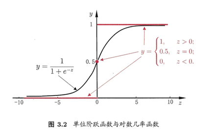
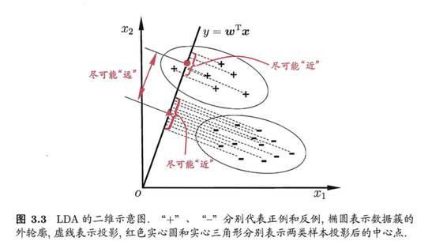

# 线性模型

### 3.1 基本形式

- 线性模型试图学得一个通过属性的线性组合来进行预测的函数，即$f(x) = w_1x_1 + w_2x_2 + ... + w_dx_d + b$，向量形式写成$f(x) = w^Tx + b$。w和b学得之后，模型就得已确定

### 3.2 线性回归

- 线性归回试图学得$f(x_i) = wx_i + b$，使得$f(x_i) \simeq y_i$
- 试图让均方差最小化$(w^*, b^*) = \mathop{\arg \min}_{(w, b)} \sum^m_{i = 1} (f(x_i) - y_i)^2 = \mathop{\arg \min}_{(w, b)} \sum^m_{i = 1} (y_i - wx_i - b)^2$
- 将$E_{(w, b)}$分别对w和b求导，得到

$$\frac{\partial E_{(w, b)}}{\partial w} = 2 (w \sum_{i = 1}^m x^2_i - \sum^{m}_{i  =1}(y_i - b)x_i)$$

$$\frac{\partial E_{(w, b)}}{\partial b} = 2 (mb - \sum^{m}_{i  =1}(y_i - wx_i))$$

- 然后另$\frac{\partial E_{(w, b)}}{\partial w}$和$\frac{\partial E_{(w, b)}}{\partial b}$分别为0可得到w和b最优解的闭式解

$$w = \frac{ \sum^m_{i = 1} y_i (x_i - \bar{x}) }{ \sum^m_{i = 1} x_i^2 - \frac{1}{2} (\sum^m_{i  =1} x_i)^2}$$

$$b = \frac{1}{m} \sum_{i = 1}^m (y_i - wx_i)$$

### 3.3 对数几率回归

- 单位阶跃函数

$$y = 
\left\{\begin{matrix}
0,  z < 0 \\
0.5, z = 0\\
1, z > 0&
\end{matrix}\right.
$$

- 对数几率函数：$y = \frac{1}{1 + e^{-z}}$，是一种“Sigmod”函数
- $y = \frac{1}{1 + e^{-(w^T + b)}}$
- 将y视为后验估计$p(y = 1 | x)$，则$\ln \frac{p(y = 1 | x)}{p(y = 0 | x)} = w^T + b$
- `极大似然估计`
- `牛顿法` $\beta^* = \mathop{\arg \min}_{\beta} \iota(\beta)$，第t+1轮迭代解的更新公式为$\beta^{t + 1} = \beta^t - (\frac{\partial^2 \iota (\beta)}{\partial \beta \partial \beta^T})^{-1} \frac{\partial \iota(\beta)}{\partial \beta}$

### 3.4 线性判别分析

- 简称`LDA`

- 监督降维技术

### 3.5 多分类学习

- 多分类学习的基本思路是“拆解法”，即将多分类任务拆为若干个二分类任务求解
- 经典的拆分策略有三种：`一对一` OvO，`一对其余` OvR，`多对多` MvM

- 最常用的MvM技术，`ECOC`是将编码思想引入类别拆分，必尽可能在解码过程中具有容错性，主要分为两步：
  - `编码`：对N个类别做M次划分，每次划分将一部分类别划为正类，一部分划分为反类，从而形成一个二分类训练集；这样一共产生M个训练集，可以训练出M个分类器
  - `解码`：M个分类器分别对测试样本进行预测，这些预测标记组成一个编码。将这个预测编码与每个类别各自的编码进行比较，返回其中距离最小的类别作为最终预测结果。

### 3.6 类别不平衡问题

- 三类做法：
  - `欠采样`：去除一些反例，使得正、反例数目接近
  - `过采样`：增加一些正例，使得正、反例数目接近
  - `阈值移动`：直接基于原始数据集进行学习，但在使用训练好的分类器进行预测时，将$\frac{{y}'}{1 - {y}'} = \frac{y}{1 - y} \times \frac{m^-}{m^+}$嵌入到其决策过程中
